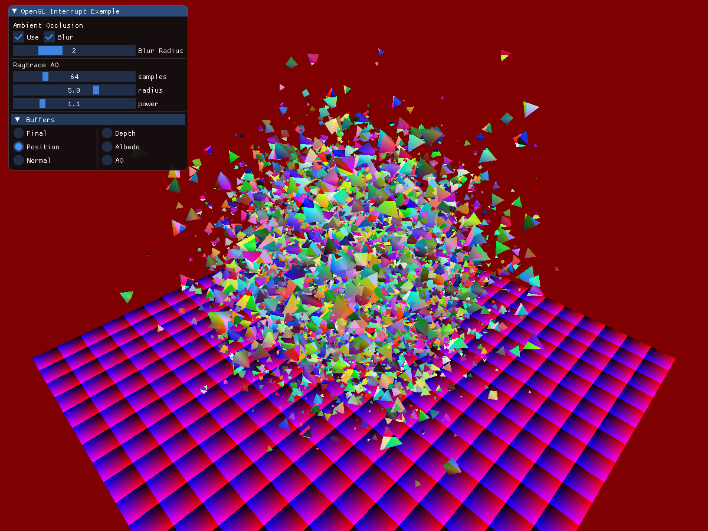
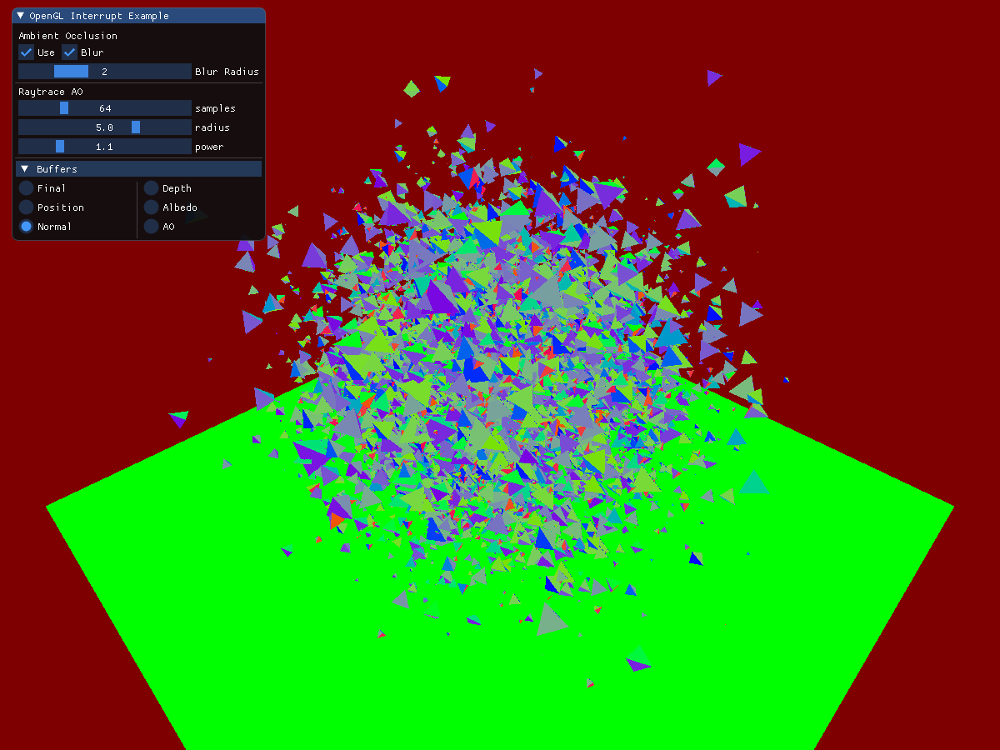
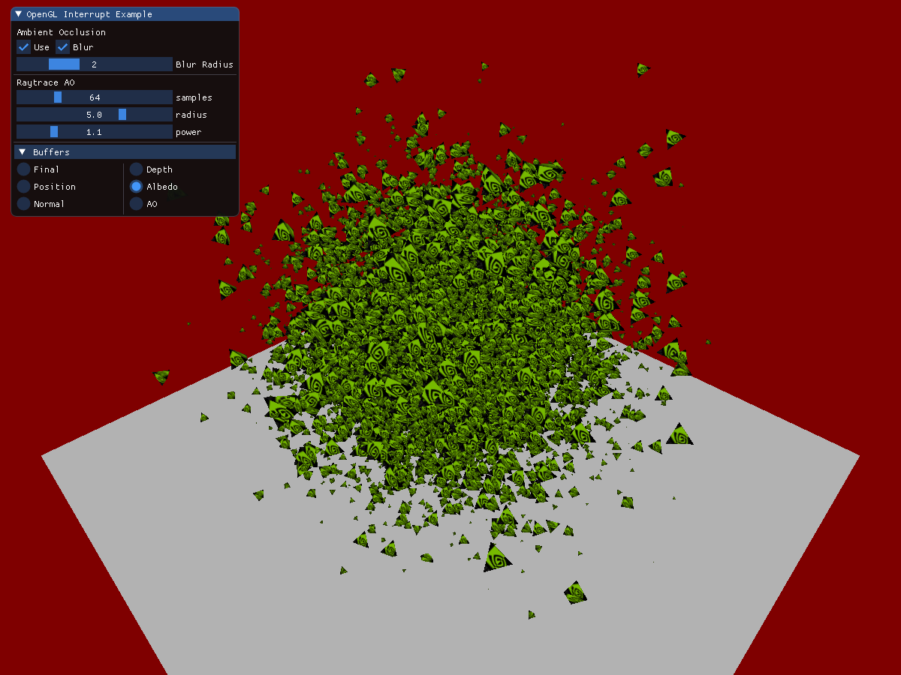
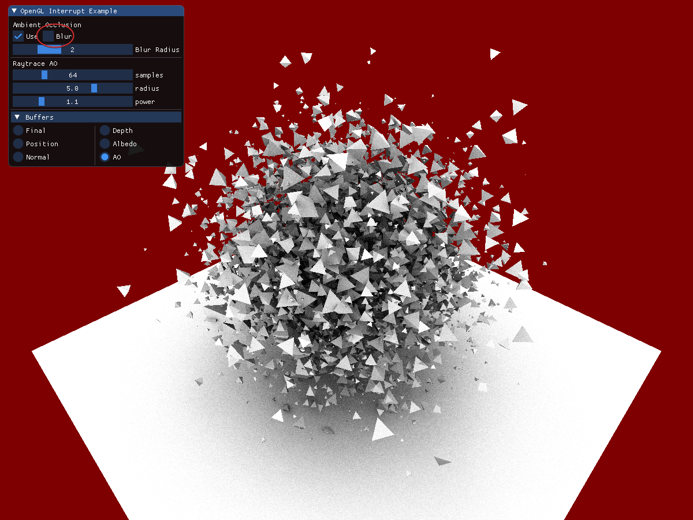
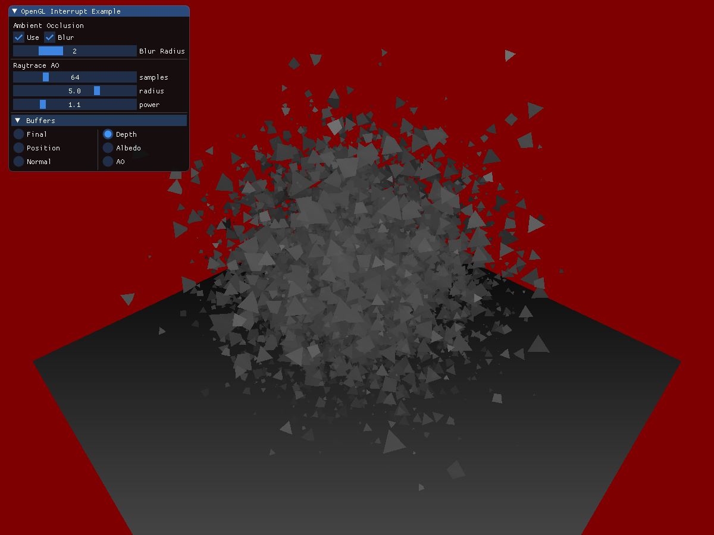

# OpenGL Interop - Raytracing

By [Martin-Karl Lefrançois](https://devblogs.nvidia.com/author/mlefrancois/)

# Introduction

This blog is a step after the introduction to OpenGL and Vulkan interop blog.
The first example explain how to mix Vulkan and OpenGL in the same application.
This one includes more buffer types and instead of using a computer shader to generate an image,
it is using raytracing to add ambient occlusion to the scene.

Topics covered in the example:
- Managing OpenGL memory from Vulkan
- G-Buffers
- Raytracing
- Semaphores
- Compositing

# Vulkan-OpenGL Memory Objects

As explained in the vk_gl_simple_interop example, all shared objects must be allocated by Vulkan.
In this example, we will use an allocator to manage the memory. This [blog](https://developer.nvidia.com/vulkan-memory-management)
gives some explaination on how it works, but actual information is also available in the header of `allocator_dma_vk.hpp`.

The allocator we are using is call DMA, which stands for Device Memory Allocator. There is the `nvvkpp::AllocatorDma` which is
a helper for creating buffers, images and acceleration structures, and the `nvvk::DeviceMemoryAllocatorGL` which does the
memory allocations. The later one has a slight variation from the none-GL, as it is flagging the allocation to be exportable
and importing the memory to OpenGL to be used.

The scene is creating all geometry meshes using a `Vertex` buffer and an `Index` buffer created with DMA/GL. We are 
allocating all geometry in the scene in Vulkan, because we want to rasterize the scene using OpenGL, but raytrace the 
scene to get ambient occlusion. For this reason, all elements of the scene are shared.
 
If you are familiar with other nvpro-samples examples, the allocation for Vulkan does not differ, but the OpenGL buffer will still need to be created.

For example, in the `VkGlExample::createFacetedTetrahedron()` where we are constructing the geometry of a tetrahedron,
the allocation is done in Vulkan.

~~~~C++
 mesh.vertices.bufVk = m_alloc.createBuffer<Vertex>(cmdBuf, vert, vk::BufferUsageFlagBits::eVertexBuffer);
~~~~

This only creates the Vulkan buffer and the memory allocated from DMA/GL was flaged to be exported. What we need is 
to create the equivalent OpenGL buffer.

~~~~C++
inline void createBufferGL(BufferVkGL& bufGl, nvvk::DeviceMemoryAllocatorGL& memAllocGL)
{
  nvvk::AllocationGL allocGL = memAllocGL.getAllocationGL(bufGl.bufVk.allocation);

  glCreateBuffers(1, &bufGl.oglId);
  glNamedBufferStorageMemEXT(bufGl.oglId, allocGL.size, allocGL.memoryObject, allocGL.offset);
}
~~~~ 

See `VkGlExample::vulkanMeshToOpenGL()` for an example on how all meshes are also represented in OpenGL.

For textures, this is done is a similar fashion. The image is created and allocated in Vulkan using DMA/GL, then 
an OpenGL version is created. 

~~~~C++
m_imageVkGL.texVk = m_alloc.createImage(cmdBuf, dataSize, dataImage, imgInfo, vk::ImageLayout::eShaderReadOnlyOptimal);
createTextureGL(m_imageVkGL, GL_RGBA8, GL_LINEAR_MIPMAP_LINEAR, GL_LINEAR, GL_REPEAT, m_dmaAllocGL);
~~~~

~~~~C++
inline void createTextureGL(Texture2DVkGL& texGl, int format, int minFilter, int magFilter, int wrap, nvvk::DeviceMemoryAllocatorGL& memAllocGL)
{
  auto allocGL = memAllocGL.getAllocationGL(texGl.texVk.allocation);

  // Create a 'memory object' in OpenGL, and associate it with the memory allocated in Vulkan
  glCreateTextures(GL_TEXTURE_2D, 1, &texGl.oglId);
  glTextureStorageMem2DEXT(texGl.oglId, texGl.mipLevels, format, texGl.imgSize.width, texGl.imgSize.height,
                           allocGL.memoryObject, allocGL.offset);
  glTextureParameteri(texGl.oglId, GL_TEXTURE_MIN_FILTER, minFilter);
  glTextureParameteri(texGl.oglId, GL_TEXTURE_MAG_FILTER, magFilter);
  glTextureParameteri(texGl.oglId, GL_TEXTURE_WRAP_S, wrap);
  glTextureParameteri(texGl.oglId, GL_TEXTURE_WRAP_T, wrap);
}
~~~~

# G-Buffers and Output Buffer

The example will render the scene in a Framebuffer Object, using 3 attached buffers.
Those buffers will later be used by the raytracer as information to send rays for the generation
of Ambient Occlusion. In this sample we used high-precision G-Buffers for ease of use,
however in a production implementation you would want to use packed formats and reconstruct
positions from existing depth-buffers. This would reduce bandwidth requirements greatly and
there is several techniques that can be used from deferred shading.

- Position RGBA32
- Normal RGBA32
- Albedo RGBA8

  

The creation of the FBO and textures is done the same way as for allocating a texture image. The difference resides in
passing nullptr to the data, as there is nothing to transfer from.

The call to `createTextureGL` is to make the image available for both OpenGL an Vulkan.

This is how we are creating the G-Buffers
~~~~C++
void VkGlExample::createGBuffers()
{
  m_queue.waitIdle();
  m_device.waitIdle();

  if(m_gFramebuffer != 0)
  {
    glDeleteFramebuffers(1, &m_gFramebuffer);
    m_gBufferColor[0].destroy(m_alloc);
    m_gBufferColor[1].destroy(m_alloc);
    m_gBufferColor[2].destroy(m_alloc);
  }

  glCreateFramebuffers(1, &m_gFramebuffer);
  glBindFramebuffer(GL_DRAW_FRAMEBUFFER, m_gFramebuffer);

  vk::DeviceSize imgSize = m_size.width * m_size.height * 4 * sizeof(float);

  auto samplerInfo = vk::SamplerCreateInfo();

  m_gBufferColor[0].imgSize = m_size;
  m_gBufferColor[1].imgSize = m_size;
  m_gBufferColor[2].imgSize = m_size;

  m_gBufferColor[0].texVk = m_alloc.createImage(nvvkpp::image::create2DInfo(m_size, vk::Format::eR32G32B32A32Sfloat));
  m_gBufferColor[1].texVk = m_alloc.createImage(nvvkpp::image::create2DInfo(m_size, vk::Format::eR32G32B32A32Sfloat));
  m_gBufferColor[2].texVk = m_alloc.createImage(nvvkpp::image::create2DInfo(m_size, vk::Format::eR8G8B8A8Unorm));

  m_gBufferColor[0].texVk.descriptor =
      nvvkpp::image::create2DDescriptor(m_device, m_gBufferColor[0].texVk.image, samplerInfo, vk::Format::eR32G32B32A32Sfloat);
  m_gBufferColor[1].texVk.descriptor =
      nvvkpp::image::create2DDescriptor(m_device, m_gBufferColor[1].texVk.image, samplerInfo, vk::Format::eR32G32B32A32Sfloat);
  m_gBufferColor[2].texVk.descriptor =
      nvvkpp::image::create2DDescriptor(m_device, m_gBufferColor[2].texVk.image, samplerInfo, vk::Format::eR8G8B8A8Unorm);

  createTextureGL(m_gBufferColor[0], GL_RGBA32F, GL_NEAREST, GL_NEAREST, GL_REPEAT, m_dmaAllocGL);
  createTextureGL(m_gBufferColor[1], GL_RGBA32F, GL_NEAREST, GL_NEAREST, GL_REPEAT, m_dmaAllocGL);
  createTextureGL(m_gBufferColor[2], GL_RGBA8, GL_NEAREST, GL_NEAREST, GL_REPEAT, m_dmaAllocGL);

  glNamedFramebufferTexture(m_gFramebuffer, GL_COLOR_ATTACHMENT0, m_gBufferColor[0].oglId, 0);
  glNamedFramebufferTexture(m_gFramebuffer, GL_COLOR_ATTACHMENT1, m_gBufferColor[1].oglId, 0);
  glNamedFramebufferTexture(m_gFramebuffer, GL_COLOR_ATTACHMENT2, m_gBufferColor[2].oglId, 0);

  {
    nvvkpp::ScopeCommandBuffer cmdBuf(m_device, m_graphicsQueueIndex);
    nvvkpp::image::setImageLayout(cmdBuf, m_gBufferColor[0].texVk.image, vk::ImageLayout::eUndefined,
                                  vk::ImageLayout::eShaderReadOnlyOptimal);
    nvvkpp::image::setImageLayout(cmdBuf, m_gBufferColor[1].texVk.image, vk::ImageLayout::eUndefined,
                                  vk::ImageLayout::eShaderReadOnlyOptimal);
    nvvkpp::image::setImageLayout(cmdBuf, m_gBufferColor[2].texVk.image, vk::ImageLayout::eUndefined,
                                  vk::ImageLayout::eShaderReadOnlyOptimal);
  }

  // - tell OpenGL which color attachments we'll use (of this framebuffer) for rendering
  unsigned int attachments[3] = {GL_COLOR_ATTACHMENT0, GL_COLOR_ATTACHMENT1, GL_COLOR_ATTACHMENT2};
  glDrawBuffers(3, attachments);

  // create and attach depth buffer (render buffer)
  unsigned int rboDepth;
  glGenRenderbuffers(1, &rboDepth);
  glBindRenderbuffer(GL_RENDERBUFFER, rboDepth);
  glRenderbufferStorage(GL_RENDERBUFFER, GL_DEPTH_COMPONENT, m_size.width, m_size.height);
  glFramebufferRenderbuffer(GL_FRAMEBUFFER, GL_DEPTH_ATTACHMENT, GL_RENDERBUFFER, rboDepth);
  // finally check if framebuffer is complete
  if(glCheckFramebufferStatus(GL_FRAMEBUFFER) != GL_FRAMEBUFFER_COMPLETE)
  {
    std::cout << "Framebuffer not complete!" << std::endl;
  }
  glBindFramebuffer(GL_DRAW_FRAMEBUFFER, 0);
}
~~~~~~~~

The ouptput buffer used by the raytracer will be done in a very similar  way. Since we
are writing to the image, the usage flag `eStorage` has to be present.

~~~~ C+++
  void createOutputImage(vk::Extent2D size)
  {
    auto usage = vk::ImageUsageFlagBits::eSampled | vk::ImageUsageFlagBits::eStorage | vk::ImageUsageFlagBits::eTransferSrc;
    vk::DeviceSize imgSize = size.width * size.height * 4 * sizeof(float);
    auto           format  = vk::Format::eR32Sfloat;
    auto           layout  = vk::ImageLayout::eGeneral;

    vk::SamplerCreateInfo samplerCreateInfo;  // default values
    vk::ImageCreateInfo   imageCreateInfo = nvvkpp::image::create2DInfo(size, format, usage);

    // Creating the image and the descriptor
    m_raytracingOutputGL.imgSize = size;
    m_raytracingOutputGL.texVk   = m_allocGL.createImage(imageCreateInfo);
    m_raytracingOutputGL.texVk.descriptor =
        nvvkpp::image::create2DDescriptor(m_device, m_raytracingOutputGL.texVk.image, vk::SamplerCreateInfo(), format, layout);

    {
      // Setting the layout to eGeneral
      nvvkpp::ScopeCommandBuffer cmdBuf(m_device, m_queueIndex);
      nvvkpp::image::setImageLayout(cmdBuf, m_raytracingOutputGL.texVk.image, vk::ImageLayout::eUndefined, layout);
    }

    // Making the OpenGL version of texture
    createTextureGL(m_raytracingOutputGL, GL_R32F, GL_LINEAR_MIPMAP_LINEAR, GL_LINEAR, GL_REPEAT, m_dmaAllocGL);
  }
~~~~~~~~

# Raytracing

The raytracing part is covered by a previous [tutorial](https://developer.nvidia.com/rtx/raytracing/vkray)

There are somehow differences in the technique used for rendering. In this example, we are rendering using
OpenGL, the world position and normal to G-Buffers. Those buffers are used in the `rayGen` shader to
be the starting point to send rays.

There is no hit shader, just a miss shader. We assume the ray will hit, but if the short ray is not hitting
any geometry, the miss shader will be called. With this information and sending many rays in the hemisphere
of the hit position, we can compute the ambient occlusion.

## Converting the Scene to Raytrace
The conversion of the meshes is done in `VkGlExample::meshToGeometry`, which is what the BLAS construction is expecting.

Then we convert all instances to the raytracing instances to create the TLAS.

## Extra

Then we create the part which is unique to this example. We first create a descriptor set and pass the
G-Buffer to be read, create a pipeline with our shaders and the shading binding table with the handles
to the shaders.

## Rendering
Once the acceleration structures are build and the raytracing pipeline is created. Rendering or
tracing rays is similar to any other Vulkan call. Once finished, see section Semaphores, the
image with AO will be filled with the data.

~~~C++
m_commandBuffer.bindPipeline(vk::PipelineBindPoint::eRayTracingNV, m_pipeline);
m_commandBuffer.bindDescriptorSets(vk::PipelineBindPoint::eRayTracingNV, m_pipelineLayout, 0, {m_descSet}, {});
m_commandBuffer.pushConstants<PushConstant>
(m_pipelineLayout, vk::ShaderStageFlagBits::eRaygenNV, 0, m_pushC);

uint32_t progSize = m_raytracingProperties.shaderGroupHandleSize;  // Size of a program identifier
vk::DeviceSize rayGenOffset   = 0;
vk::DeviceSize missOffset     = progSize;
vk::DeviceSize missStride     = progSize;
vk::DeviceSize hitGroupOffset = progSize + progSize; // not used
vk::DeviceSize hitGroupStride = progSize;            // not used

m_commandBuffer.traceRaysNV(m_sbtBuffer.buffer, rayGenOffset, m_sbtBuffer.buffer, missOffset, missStride,
m_sbtBuffer.buffer, hitGroupOffset, hitGroupStride, vk::Buffer{}, 0, 0,
m_raytracingOutputGL.extent.width, m_raytracingOutputGL.extent.height, 1, m_vkctx.dynamicDispatch);
~~~~

The result of the raytracer (Ambient Occlusion) will go in a result texture, which will be used when
compositing the final image.

!!! Note
The raytracing code is under `raytrace_vk.hpp` and `raytrace_interop.hpp`

# Semaphores

Drawing with OpenGL or with Vulkan is not immediate and to make sure the information about the stage is
communicated between Vulkan and OpenGL, we use semaphores.

Surrounding the call to the actual raytracing, we have to signal Vulkan to wait for the `vk/gl/Complete`.
Vulkan will raytrace the image and it will signal `vk/gl/Ready`, where OpenGL wait for the signal.
This is important, otherwise the combination of the image will be missing parts.

~~~~ C++
// Raytracing the scene
GLuint outRayID = m_ray.outputImage().oglId;
{
// Once render is complete, signal the Vulkan semaphore indicating it can start render
GLenum dstLayout = GL_LAYOUT_SHADER_READ_ONLY_EXT;
GLenum srcLayout = GL_LAYOUT_COLOR_ATTACHMENT_EXT;
glSignalSemaphoreEXT(m_ray.semaphores().glComplete, 0, nullptr, 1, &outRayID, &dstLayout);
m_ray.run();
// And wait (on the GPU) for the raytraced image
glWaitSemaphoreEXT(m_ray.semaphores().glReady, 0, nullptr, 1, &outRayID, &srcLayout);
}
~~~~

# Compositing

This is the final step, where the various textures are used to compose the final image.

A naive approach would be to return `Albedo * Occlusion`, but in this example we are
also doing a box filtering on the occlusion texture. To avoid bluring neighbor objects
a depth test is done using the `w` component of the `position` texture.

# Final Image

